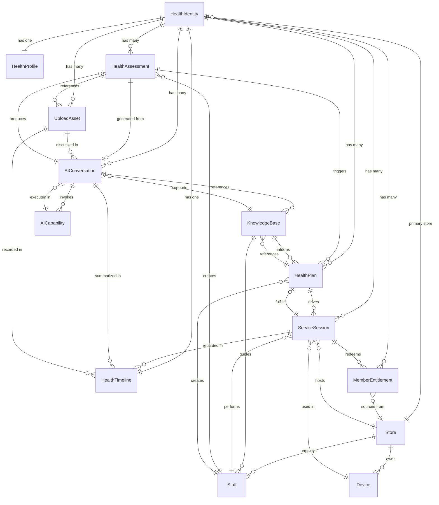
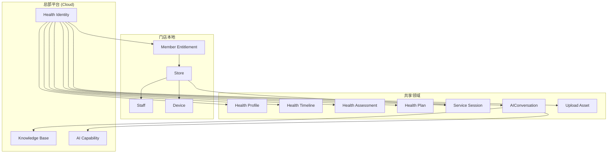

# RFC-001 Health One Domain Model

Document ID : RFC-001
Title       : Health One Domain Model
Version     : 1.0
Status      : Proposed
Owner       : Architecture Office
Created     : 2026-06-28
Depends On  : Constitution §4 (Health Identity), Constitution §7 (Architecture Principles), ADR-001, BP-001, BP-004
Related     : RFC-002 (Data Model, pending), PRD (pending)

---

## 1. Design Goals

本 RFC 定义 Health One 的领域模型（Domain Model），目标如下：

| # | Goal | Source |
|---|---|---|
| G1 | 以 Health Identity（健康元）为唯一核心聚合根 | Constitution §4 |
| G2 | 领域对象围绕业务领域设计，非围绕页面或数据库表设计 | Constitution §7.3 |
| G3 | 所有健康数据可追溯、所有 AI 输入可解释 | Constitution §8 |
| G4 | AI 不直接操作数据库，AI 调用系统 Capability | Constitution §5.4 |
| G5 | 门店拥有本地业务数据，总部负责平台能力 | Constitution §7.4 |
| G6 | 模型支持 MVP 第一闭环：建立健康元→AI分析→服务→记录→随访 | Constitution §12 |
| G7 | 为后续 Data Model (RFC)、API、PRD 提供统一的业务语言 | Governance §5 |
| G8 | 模块独立，模块之间通过接口通信 | Constitution §7.2 |

---

## 2. Core Domain Objects

### 2.1 Health Identity（健康元）

```
Name:           Health Identity
Chinese:        健康元
Responsibility: 一个人的长期健康数字身份。不是账号，不是客户编号。
               是整个系统的核心聚合根（Aggregate Root）。
                所有健康数据最终围绕 Health Identity 组织。
Owned Data:
  - identity_id          (唯一标识)
  - display_name         (显示名称)
  - activation_status    (激活状态: pending / active / archived)
  - created_at           (创建时间)
  - activated_at         (激活时间)
  - primary_store_id     (主归属门店)
  - data_ownership_tag   (数据归属标记: customer / platform)
Depends On:
  - Store (主归属门店)
Used By:
  - Health Profile
  - Health Timeline
  - Health Assessment
  - Health Plan
  - Service Session
  - AI Conversation
  - Upload Asset
  - Member Entitlement
```

### 2.2 Health Profile（健康档案）

```
Name:           Health Profile
Chinese:        健康档案
Responsibility: 存储与 Health Identity 关联的结构化健康信息。
                Profile 是 Health Identity 的健康快照和基础信息载体。
                它不是病历，而是长期健康管理的结构化记录。
Owned Data:
  - profile_id
  - identity_id          (FK → Health Identity)
  - basic_info           (出生日期、性别、身高、体重等)
  - medical_summary      (已知健康状况摘要，非诊断)
  - lifestyle_notes      (生活方式备注：运动、饮食、睡眠等)
  - primary_concern      (主要健康关注)
  - last_updated_at
Depends On:
  - Health Identity (每个 Profile 必须属于一个 Health Identity)
Used By:
  - Health Assessment (作为评估的输入上下文)
  - AI Conversation (作为 AI 推理的上下文)
  - Health Plan (作为计划制定的参考)
```

### 2.3 Health Timeline（健康时间线）

```
Name:           Health Timeline
Chinese:        健康时间线
Responsibility: 以时间顺序记录 Health Identity 下所有健康相关事件。
                Timeline 是追溯性和可解释性的基础。
                它不是独立的"事件表"，而是所有领域事件的聚合视图。
Owned Data:
  - timeline_id
  - identity_id          (FK → Health Identity)
  - entries[]            (时间线条目列表)
    每个条目包含:
    - entry_id
    - timestamp
    - event_type         (assessment_created / plan_updated / service_completed
                           / ai_conversation_summarized / asset_uploaded / etc.)
    - source_object_type (HealthAssessment / ServiceSession / AIConversation / etc.)
    - source_object_id
    - summary_text
    - performed_by       (staff_id / ai_capability_id / identity_id)
Depends On:
  - Health Identity
Used By:
  - AI Conversation (AI 获取时间上下文)
  - Health Assessment (评估参考历史)
  - Store Staff (了解客户健康历程)
```

### 2.4 Health Assessment（健康评估）

```
Name:           Health Assessment
Chinese:        健康评估
Responsibility: 对 Health Identity 在某一时间点的健康状况进行评估。
                Assessment 可以由 AI 生成、也可以由门店员工记录。
                它是对 Health Profile 和 Timeline 的阶段性分析。
Owned Data:
  - assessment_id
  - identity_id          (FK → Health Identity)
  - assessment_type      (ai_generated / staff_recorded / combined)
  - source_conversation_id (FK → AI Conversation, 可选)
  - reference_asset_ids  (关联的 Upload Asset 列表)
  - concern_area         (关注的健康领域)
  - findings_summary     (评估发现摘要)
  - confidence_level     (AI 置信度: high / medium / low / uncertain)
  - recommendation_summary (建议摘要)
  - created_by           (staff_id / ai_capability_id)
  - created_at
  - reviewed_by          (人工复核人)
  - reviewed_at
Depends On:
  - Health Identity
  - AI Conversation (可选，当评估来自 AI 对话时)
  - Upload Asset (可选，评估可引用上传的检测报告等)
Used By:
  - Health Plan (评估触发或更新健康计划)
  - Health Timeline (评估产生时间线条目)
  - AI Conversation (后续对话引用评估结果)
```

### 2.5 Health Plan（健康计划）

```
Name:           Health Plan
Chinese:        健康计划
Responsibility: 为 Health Identity 制定的健康改善或维护计划。
                Plan 是"接下来做什么"的载体。
                它连接评估结果和具体服务执行。
Owned Data:
  - plan_id
  - identity_id          (FK → Health Identity)
  - plan_status          (draft / active / completed / archived)
  - source_assessment_ids (触发计划的评估列表)
  - goals[]              (健康目标列表)
    每个目标包含:
    - goal_description
    - target_date
    - progress_status
  - recommended_services[] (推荐的服务类型)
  - follow_up_schedule   (随访计划)
  - created_by           (ai_capability_id / staff_id)
  - created_at
  - updated_at
Depends On:
  - Health Identity
  - Health Assessment (计划基于评估结果)
  - Knowledge Base (推荐服务时可参考知识库)
Used By:
  - Service Session (计划驱动服务预约/执行)
  - AI Conversation (AI 基于计划进行随访)
  - Health Timeline (计划变更产生时间线条目)
  - Staff (门店员工查看客户计划)
```

### 2.6 Service Session（服务记录）

```
Name:           Service Session
Chinese:        服务记录 / 服务会话
Responsibility: 记录一次真实门店服务执行的全部信息。
                Service Session 是"真实世界发生了什么的"事实记录。
                它是 MVP 第一闭环的核心对象。
Owned Data:
  - session_id
  - identity_id          (FK → Health Identity)
  - store_id             (FK → Store)
  - staff_id             (FK → Staff, 执行服务的人员)
  - plan_id              (FK → Health Plan, 可选)
  - service_type         (服务类型)
  - device_ids[]         (使用的设备列表)
  - pre_service_notes    (服务前备注：客户状态、关注点)
  - service_detail       (服务内容描述)
  - post_service_notes   (服务后观察)
  - customer_feedback    (客户当场反馈)
  - next_step_suggestion (建议下一步)
  - started_at
  - completed_at
  - recorded_by          (记录人)
Depends On:
  - Health Identity
  - Store (服务必须在某个门店执行)
  - Staff (服务由员工执行)
  - Health Plan (可选，服务可能来自计划)
  - Device (可选，服务可能使用设备)
Used By:
  - Health Timeline (产生时间线条目)
  - Health Assessment (作为后续评估的输入)
  - AI Conversation (AI 获取服务历史)
  - Member Entitlement (核销权益)
```

### 2.7 Store（门店）

```
Name:           Store
Chinese:        门店
Responsibility: 真实世界的健康服务节点。
                Store 是服务执行、客户接待、数据采集的物理场所。
                Store 拥有本地业务数据。
Owned Data:
  - store_id
  - store_name
  - store_code
  - location             (地址)
  - contact_info
  - operating_status     (active / inactive / pilot)
  - store_type           (直营 / 合作 / 加盟)
  - config               (门店级配置)
  - local_knowledge      (门店本地知识)
Depends On:
  - (无上游依赖，Store 是独立模块)
Used By:
  - Service Session
  - Staff
  - Device
  - Member Entitlement (权益绑定的门店)
  - Health Identity (主归属门店)
```

### 2.8 Staff（员工）

```
Name:           Staff
Chinese:        门店员工
Responsibility: 在门店执行服务、接待客户、记录观察的人员。
                Staff 是 Health One 人机协同的关键角色。
Owned Data:
  - staff_id
  - store_id             (FK → Store)
  - display_name
  - role                 (店长 / 健康管理师 / 服务人员 / etc.)
  - contact_info
  - status               (active / inactive)
  - certifications[]     (资质/培训记录)
Depends On:
  - Store (员工属于某个门店)
Used By:
  - Service Session
  - Health Assessment (员工可创建评估)
  - Health Plan (员工可制定计划)
```

### 2.9 Device（设备）

```
Name:           Device
Chinese:        健康设备
Responsibility: 门店内用于健康服务的物理设备。
                Device 不是孤立设备，而是服务基础设施和健康记录来源。
                当前重要设备类型：石墨烯远红外健康舱。
Owned Data:
  - device_id
  - store_id             (FK → Store)
  - device_type          (设备类型)
  - device_code          (设备编号)
  - operating_status     (active / maintenance / offline)
  - device_config        (设备参数配置)
  - maintenance_records[] (维护记录)
Depends On:
  - Store (设备属于某个门店)
Used By:
  - Service Session (服务中使用设备)
```

### 2.10 AI Conversation（AI 对话）

```
Name:           AI Conversation
Chinese:        AI 对话
Responsibility: 用户与 AI Health Companion 之间的一次或多次对话。
                AI Conversation 不是随意的聊天记录。
                它是通过 AI Capability 调用、在授权上下文中完成的
                结构化交互。
Owned Data:
  - conversation_id
  - identity_id          (FK → Health Identity)
  - conversation_type    (intake / assessment / follow_up / guidance / check_in)
  - capability_ids[]     (调用的 AI Capability 列表)
  - context_snapshot     (对话时的上下文：Profile、Timeline 等引用)
  - messages[]           (对话消息)
  - summary              (对话摘要，结构化)
  - generated_assessment_id (FK → Health Assessment, 如对话产生了评估)
  - confidence_notes     (不确定性标注)
  - traceability_log     (可追溯日志：输入、推理、输出)
  - started_at
  - ended_at
Depends On:
  - Health Identity
  - AI Capability (对话通过 Capability 执行)
Used By:
  - Health Assessment (基于对话生成评估)
  - Health Timeline (对话摘要产生时间线条目)
  - Health Plan (基于对话生成或更新计划)
```

### 2.11 Upload Asset（上传资产）

```
Name:           Upload Asset
Chinese:        上传资产
Responsibility: 用户或门店上传的图片、文件、报告等非结构化数据。
                Upload Asset 是健康档案的附件和证据来源。
Owned Data:
  - asset_id
  - identity_id          (FK → Health Identity)
  - uploader_type        (customer / staff)
  - uploader_id          (上传者标识)
  - asset_type           (report / image / document / other)
  - asset_category       (检测报告 / 体检报告 / 病历 / 其他)
  - file_reference       (文件存储引用)
  - description          (描述)
  - uploaded_at
  - ai_processed         (是否已 AI 分析)
  - ai_summary           (AI 对资产的摘要，如果有)
Depends On:
  - Health Identity
Used By:
  - Health Assessment (评估可引用资产作为证据)
  - Health Timeline (上传产生时间线条目)
  - AI Conversation (AI 可基于资产内容进行对话)
```

### 2.12 Member Entitlement（会员权益）

```
Name:           Member Entitlement
Chinese:        会员权益
Responsibility: 记录 Health Identity 拥有的服务权益、套餐、次数等。
                Entitlement 是"客户可以享受什么服务"的依据。
                不是支付系统，不是交易系统。
Owned Data:
  - entitlement_id
  - identity_id          (FK → Health Identity)
  - entitlement_type     (service_package / membership / trial / gifted)
  - service_type         (关联的服务类型)
  - total_quota          (总次数/额度)
  - used_quota           (已使用次数)
  - valid_from
  - valid_until
  - source_store_id      (权益来源门店)
  - status               (active / exhausted / expired / cancelled)
Depends On:
  - Health Identity
  - Store (权益来源门店)
Used By:
  - Service Session (服务执行时核销权益)
  - Staff (门店查看客户权益)
```

### 2.13 Knowledge Base（知识库）

```
Name:           Knowledge Base
Chinese:        知识库
Responsibility: 存储结构化知识，支持 AI 推理和门店员工参考。
                Knowledge Base 是系统组件，不是文档目录。
                知识覆盖服务说明、设备知识、随访话术、
                健康指导、运营规范等。
Owned Data:
  - knowledge_entry_id
  - category             (service / device / follow_up / health_guidance / operation)
  - title
  - content              (结构化知识内容)
  - tags[]
  - applicable_stores[]  (适用门店范围)
  - version
  - reviewed_by
  - status               (draft / published / deprecated)
  - created_at
  - updated_at
Depends On:
  - (Knowledge Base 是独立模块，可被平台统一管理)
Used By:
  - AI Conversation (AI 检索知识库回答用户问题)
  - Health Plan (推荐服务时参考知识库)
  - Staff (门店员工查阅服务知识)
  - Store (门店本地知识)
```

### 2.14 AI Capability（AI 能力）

```
Name:           AI Capability
Chinese:        AI 能力
Responsibility: 定义 AI 可以执行的系统能力。
                AI 不直接操作数据库。AI 通过调用 Capability 完成任务。
                每个 Capability 是一个有明确输入输出的能力单元。
                Capability 是 Constitution §5.4 的技术实现载体。
Owned Data:
  - capability_id
  - capability_name      (例如: summarize_timeline / generate_assessment
                           / suggest_follow_up / answer_from_knowledge_base
                           / analyze_uploaded_asset)
  - description
  - input_schema         (输入参数规范)
  - output_schema        (输出参数规范)
  - required_context     (需要哪些上下文: Profile / Timeline / Assessment / etc.)
  - authorization_level  (需要的授权级别)
  - traceability         (是否必须记录可追溯日志)
  - status               (active / deprecated)
Depends On:
  - (AI Capability 是平台级定义，独立于具体对话)
Used By:
  - AI Conversation (对话调用 Capability 执行具体任务)
```

---

## 3. Domain Relationship Diagram



---

## 4. Domain Rules

### 4.1 Identity & Ownership

| # | Rule |
|---|---|
| R1.1 | 一个 Health Identity 必须有且只有一个主归属 Store |
| R1.2 | Health Identity 的 data_ownership_tag 默认值为 `customer` |
| R1.3 | Health Identity 激活后才能创建 Health Profile |
| R1.4 | 每个 Health Identity 有且只有一个 Health Profile |

### 4.2 Assessment & Plan

| # | Rule |
|---|---|
| R2.1 | 一个 Health Assessment 可以关联零个或一个 AI Conversation |
| R2.2 | 一个 Health Assessment 可以关联零个或多个 Upload Asset |
| R2.3 | 一个 Health Assessment 可以触发零个或多个 Health Plan |
| R2.4 | 一个 Health Plan 必须关联至少一个 Health Assessment 作为依据 |
| R2.5 | AI 生成的 Assessment 必须标注 confidence_level |
| R2.6 | AI 生成的 Assessment 在 MVP 阶段必须经过 Staff reviewed_by |

### 4.3 Service Session

| # | Rule |
|---|---|
| R3.1 | 一个 Service Session 必须属于一个 Health Identity |
| R3.2 | 一个 Service Session 必须属于一个 Store |
| R3.3 | 一个 Service Session 必须由至少一个 Staff 执行 |
| R3.4 | 一个 Service Session 可以使用零个或多个 Device |
| R3.5 | 一个 Service Session 可以选择关联零个或一个 Health Plan |
| R3.6 | 一个 Service Session 可以选择核销零个或一个 Member Entitlement |
| R3.7 | Service Session 完成后必须产生 Health Timeline 条目 |
| R3.8 | Service Session 完成后必须触发 Follow-Up 检查 |

### 4.4 AI Conversation & Capability

| # | Rule |
|---|---|
| R4.1 | AI Conversation 必须属于一个 Health Identity |
| R4.2 | AI Conversation 必须通过 AI Capability 执行具体任务 |
| R4.3 | AI Conversation 不得直接操作数据库 |
| R4.4 | AI Conversation 的所有输入和输出必须记录在 traceability_log |
| R4.5 | 每个 AI Capability 必须有明确的 input_schema 和 output_schema |
| R4.6 | AI Capability 的 authorization_level 决定其可以访问的上下文范围 |

### 4.5 Upload Asset

| # | Rule |
|---|---|
| R5.1 | Upload Asset 必须属于一个 Health Identity |
| R5.2 | Upload Asset 的 uploader_type 必须为 customer 或 staff |
| R5.3 | Upload Asset 可被多个 Health Assessment 引用 |
| R5.4 | Upload Asset 可被多个 AI Conversation 讨论 |

### 4.6 Member Entitlement

| # | Rule |
|---|---|
| R6.1 | Member Entitlement 必须属于一个 Health Identity |
| R6.2 | Member Entitlement 的 source_store_id 必须指向一个存在的 Store |
| R6.3 | Service Session 核销权益时，used_quota 不能超过 total_quota |
| R6.4 | 过期或取消的 Entitlement 不能再被核销 |

### 4.7 Timeline & Traceability

| # | Rule |
|---|---|
| R7.1 | 以下事件必须产生 Health Timeline 条目：Assessment 创建、Plan 变更、Service Session 完成、AI Conversation 产生摘要、Upload Asset 上传 |
| R7.2 | 每个 Timeline 条目必须有 source_object_type 和 source_object_id |
| R7.3 | Timeline 条目不可删除，不可修改（只追加） |

---

## 5. Module Boundaries

根据 Constitution §7.2 (Modular Design) 和 §7.4 (Local First)，领域模型划分为以下模块边界：



**模块通信原则：**
- 门店本地数据（Store, Staff, Device）由门店管理，总部通过接口同步
- 平台数据（Health Identity, Knowledge Base, AI Capability）由总部管理
- 共享领域对象跨总部和门店，通过接口访问

---

## 6. Non-Goals

本 RFC **不涉及**以下内容，留待后续文档定义：

| # | Non-Goal | 后续文档 |
|---|---|---|
| N1 | 数据库表结构、字段类型、索引设计 | RFC-002 Data Model |
| N2 | API 端点定义、请求/响应格式 | API Specification |
| N3 | UI 页面布局、交互流程 | PRD / UI Design |
| N4 | 权限模型细节（RBAC/ABAC） | RFC Security & Auth |
| N5 | 技术栈选型（语言/框架/数据库） | ADR Technical Stack |
| N6 | AI 模型选型、Prompt 设计 | AI Specification |
| N7 | 支付、交易、结算 | 非 MVP 范围 |
| N8 | 多门店 SaaS 架构 | 非 MVP 范围 |
| N9 | 旧系统数据迁移方案 | RFC Legacy Migration |
| N10 | 部署、运维、监控 | ADR Infrastructure |

---

## 7. Risks & Open Questions

### Risks

| # | Risk | Mitigation |
|---|---|---|
| RK1 | 领域模型过早过度设计 | 当前仅定义 MVP 必需的 14 个核心对象，不扩展非 MVP 对象 |
| RK2 | 与已有 BP-004 的 28 对象模型不一致 | 本 RFC 是对 BP-004 的精简和重构，以 Constitution v1.0 为准 |
| RK3 | AI Conversation 作为领域对象的粒度争议 | 明确 AI Conversation 是业务对象，非技术日志 |

### Open Questions

| # | Question | Status |
|---|---|---|
| Q1 | Health Timeline 是独立聚合还是 Health Identity 下的值对象？ | 当前设计为独立聚合，待 Architecture Office 确认 |
| Q2 | Member Entitlement 是否应由独立的支付/交易模块管理？ | MVP 阶段简化为 Health Identity 下的权益记录 |
| Q3 | Store 和 Staff 的认证与 Health Identity 的关系？ | 留待 Auth RFC 定义 |
| Q4 | Knowledge Base 的版本管理和同步策略？ | 留待 Knowledge Platform RFC |

---

## 8. Compliance with Constitution

| Constitution Principle | Compliance |
|---|---|
| §4 Health Identity 是核心对象 | ✅ Health Identity 是唯一聚合根 |
| §5.4 AI Capability Based | ✅ AI Conversation 通过 AI Capability 执行，不直接操作数据 |
| §7.2 Modular Design | ✅ 14 个对象明确模块边界 |
| §7.3 Domain Driven | ✅ 模型围绕业务领域设计 |
| §7.4 Local First | ✅ Store 拥有本地业务数据，总部负责 Platform 能力 |
| §8 数据属于用户 | ✅ data_ownership_tag 默认 customer |
| §8 可追溯 | ✅ Health Timeline + traceability_log |
| §8 可解释 | ✅ AI Conversation 记录输入/推理/输出 |

---

## 9. End of Document

RFC-001 定义 Health One 的领域模型 v1.0。

本 RFC 状态为 Proposed，待 Architecture Office 审查、Founder 批准后升级为 Accepted。

所有后续 Data Model、API、PRD 文档应保持与本领域模型一致。
